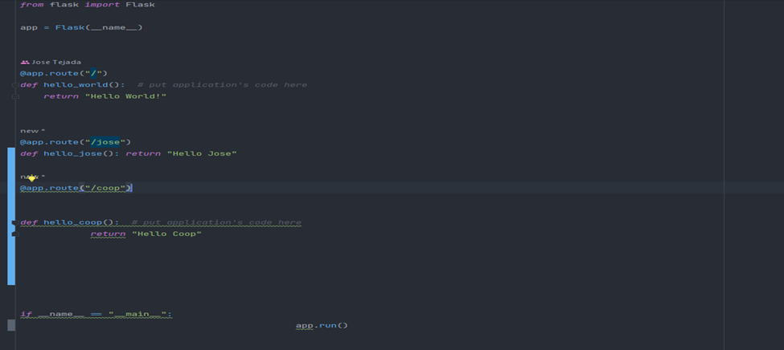
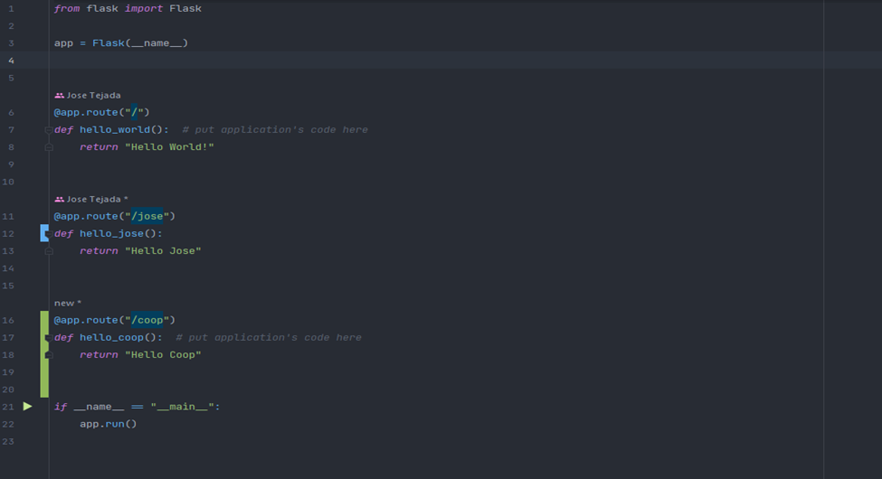

1) Pre-commit-config.yaml is the configuration file to add pylint and black
2) Pylint checks for errors in the code and black formats.
3) .pylint is the file that will decide which errors will be checked in github actions. For the dev and main branch only.
4) There is linting when merging into development and main.
5) Code will not merge without a passed code review.
6) I verified that i myself cannot review my own code

This is a precommit check for formatting.

